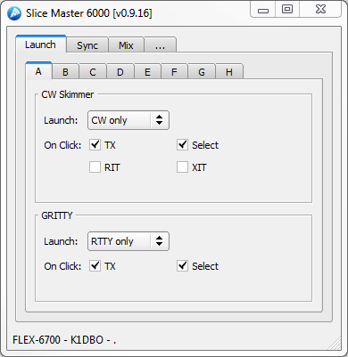
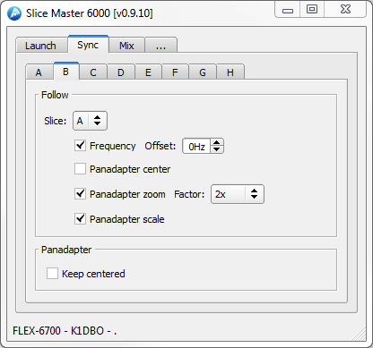
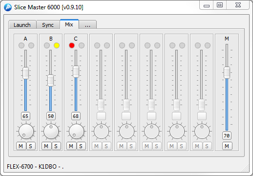
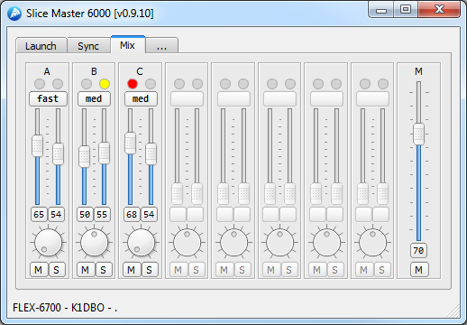
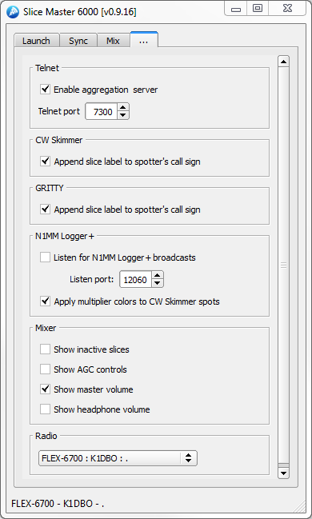

# Slice Master 6000
### version 0.9.16
### Donald Beaudry (K1DBO)

------------------------------------------ 

#### Take control of your Flex 6000 series radio's slice receivers with Slice Master 6000.

# Features
#### Simplifies CW Skimmer configuration
#### Colors CW Skimmer spots with N1MM Logger+ multipliers
#### Launches CW Skimmer automatically depending on mode
#### Launches GRITTY automatically depending on mode
#### Aggregates CW Skimmer and GRITTY spots into a single telnet connection
#### Synchronizes slice and panadapter attributes between slices
#### Provides audio mixer panel with solo, mute, and presets

Slice Master 6000's primary focus is on dynamically configuring and
launching CW Skimmer to work with the slice receivers in your radio.
A CW Skimmer instance can be launched for any active slice so long as
its panadapter is assoicated with a DAX IQ channel.  Clicking on a
signal in the CW Skimmer window will cause the associated slice
receiver to change frequency.  Likewise, changing the frequency of a
slice receiver will cause the associated CW Skimmer to follow along.

Slice Master 6000 is not just for CW.  It's powerful slice and
panadapter syncronziation features, and it's convienient audio mixer
panel make it useful in any mode.

# Getting Started

Download the latest release from

https://github.com/K1DBO/slice-master-6000/releases 

and open the zip file.  The executable is all you'll need and doesn't
require a formal installation.  You can run it from anywhere.  Windows
is likely to ask you to allow a firewall exception so Slice Master can
estabilish a network connection with CW Skimmer and with your radio.

It is important to have already installed and configured CW
Skimmer. When Slice Master needs to create a new CW Skimmer instance
it will start with the default configuration.  If something goes wrong
with the configuration process, you can remove the newly created
config files.  They should be found in

C:\Users\\<your-user-name\>\AppData\Local\K1DBO\slice-master 

and named Slice-A though Slice-H.

# Configuration

Once running Slice Master will present you with a collection of tabs
to control various aspects of your slices.  

## Launch

The Launch tab lets you decide when/if a CW Skimmer will be launched
for each of the slices.  If set to 'CW only', anytime the slice is
switched into CW mode, a skimmer will be configured for the slice and
launched.  If set to 'When active', this will happen any time the
slice is in use.  The 'On Click' options are useful when operating
split and control what happens when you click on a signal in CW
Skimmer.  'On Click' can be set to TX, active, or both.  

You can also choose to use XIT/RIT when clicking close to the current
signal.  This will let you "listen around" while keeping your TX
frequency fixed or "xmit around" while keeping your RX frequency
fixed.  When either option is selected and CW Skimmer is clicked
within 500hz of the slice frequency, the XIT or RIT offset will be
adjusted.  Click outside of this range to reset XIT/RIT to zero.

Similar launch features are available for GRITTY as well.  XIT/RIT
support is available.

## Sync

The Sync tab lets you choose how slices interact with each other.
Each slice supports a "follow" option.  This option is used to make
the frequency of one slice follow the frequency of another slice.  So,
if slice B is set to follow slice A, anytime slice A changes
frequency, slice B will follow with a change of frequency.  If you
would like slice A and slice B to always have the same frequency,
you'll have to tell slice A to follow slice B and slice B to follow
slice A.  Otherwise, moving slice B will not cause slice A to move.
If you would like slice B to follow close to slice A but not match it
exactly, you can specify a value in the offset field.

Selecting 'Panadapter Center' will cause the center frequency of a
slice's panadapter to change whenever the center frequency of the
followed slice's panadapter changes.

'Panadapter zoom' will cause the display bandwidth of the slice's
panadapter to follow changes to the displayed bandwidth of the
followed slice.  A scaling factor can be applied to by setting the
factor option.

'Panadapter scale' will cause the vertical scale of slice's panadapter
to follow the vertical scale of the followed slice.

Selecting 'Keep centered' will cause the slice's panadapter to be
recentered under the slice frequency.

## Mix

The Mix tab gives you a convenient place to control the audio settings
of all your slices.  The vertical slider will adjust the audio gain,
while the knob adjusts the pan.  The button between them shows the
current audio gain and can be activated to reset the gain and pan to a
preset value.  The 'M' button will mute the slice while the 'S', solo,
button mute all other slices.

If you hold the shift key while clicking on the gain preset button,
instead of returning the gain to the preset value, the preset values
will be changed to the current values.  So the next time you activate
the button, the gain and pan will be restored to the current values.

The Mix section of the settings page allows the mixer to be
customized.  If you'd like to hide inactive slices or enable AGC
adjustments, select the corresponding options there.

With AGC controls enabled each slice will have two sliders.  One for
the audio gain and another for the AGC threshold.  A button for the
AGC mode is also provided.  The AGC preset button works like the
preset button for the audio gain except it affects only the AGC
threshold and AGC mode.

## Settings

The Settings tab lets you control the less slice specific aspects of
Slice Master.  

Enable the aggregation server if you would like a logging program or
cluster telnet client to receive the spots found by CW Skimmer.  Your
logging program or telnet client should connect to the aggregation
server on the 'Telnet port'.  This eliminates the need to restart or
reconfigure your telnet client each time a CW Skimmer starts or stops.

When a CW Skimmer or GRITTY instance is launched, it needs to use a
network (telnet) port to communicate with Slice Master.  This port 
will be allocated automatically.

If 'Append slice label' is checked for CW Skimmer or GRITTY the slice
label (A-H) will be appended to the callsign that the program uses
when posting the spot.  This can be helpful, when using two skimmers
on the same band but with different antennas.  If, instead, you're
passing the spots to an upstream cluster node, you might consider
leaving this option disabled.

N1MM Logger+ users can broadcast their multipliers to Slice Master.
Slice Master's default is to listen on N1MM's default broadcast port
12060. You'll just need to enable the broadcasts in the N1MM Logger+
Configurer dialog.  See the N1MM Logger+ documentation for more
information.

The Mixer section of the settings tab lets you control the visibilty
of the master volume control and the headphone volume control.  Note
that when operating with "REMOTE" selected in SmartSDR, the master
volume control is does not function.  This is a limitation of
SmartSDR. Controls for inactive slices can be hidden and additional
controls adjusting AGC parameters and be enabled.

# Trouble Shooting

On occasion, CW Skimmer will not start properly and display an "access
violation" dialog.  When this happens, you can shut down CW Skimmer by
selecting the tab for the slice and choosing 'never' as the launch
option.  Then, try restarting by selecting 'CW only' or 'When active'.

If a CW Skimmer instance doesnt appear when you think it should,
verify that the slice receiver is active (visible somewhere in
SmartSDR) and set to CW mode if 'CW only' was selected as the launch
option.  Also make sure that the panadapter containing the slice has a
DAX IQ channel selected.  When attempting to restart CW Skimmer, as
described above, keep an eye on Slice Master's status line.  Many
start up errors are reported there.

Sometimes you really do need to reboot everything.  If everything
seems to be working correctly but CW Skimmer launches with the wrong
'Signal I/O Device' in it's settings, first try restarting DAX.  But
if that doesnt fix it, reboot.  

